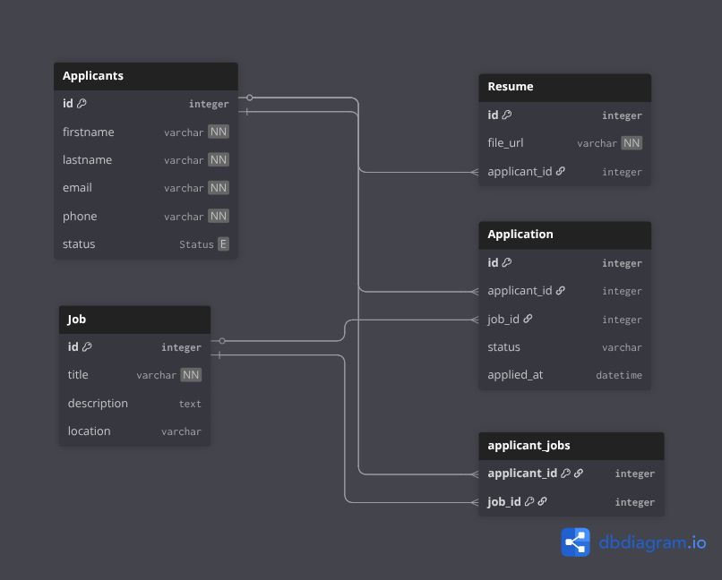

# Job Application Management System



## 🗄️ Database Diagram
### Table Structure:
* Applicants:
  * One-to-One with Resume
  * One-to-Many with Applications
  * Many-to-Many with Jobs (via Applications)
* Resume:
  * One-to-One with Applicants
  * Stores file URL or PDF blob
* Applications:
  * Many-to-One with Applicants
  * Many-to-One with Jobs
* Jobs:
  * One-to-Many with Applications
  * Many-to-Many with Applicants (via Applications)
* Applicant_Jobs (Join Table):
  * Many-to-Many relationship between Applicants and Jobs

[](https://www.oracle.com/java/)
[](https://spring.io/projects/spring-boot)
[](https://www.docker.com/)
[](https://www.postgresql.org/)
[](https://www.openapis.org/)

A Spring Boot application for managing job applicants, jobs, and applications.  
Built with **Java 21, Spring Boot, JPA (Hibernate), PostgreSQL**, and packaged with **Docker** and **Jenkins**.

---

## 🚀 Features
- Manage Applicants (create, update, delete, list all)
- Manage Jobs (create, view by ID, list all, assign to applicants)
- Manage Applications (create links to applicants)
- REST API with OpenAPI/Swagger documentation

---

## 🐳 Running with Docker

### 1. Pull the image
```bash
docker pull eustachekamala/job-application-management-system:latest
```
### 2. Run the container
```bash
docker run -d -p 8080:8080 eustachekamala/job-application-management-system:latest
```
### 3. Access the application
- API Documentation: [https://job-application-management-system-latest-qvm4.onrender.com/swagger-ui/index.html](https://job-application-management-system-latest-qvm4.onrender.com/swagger-ui/index.html)
- OpenAPI Spec: [https://job-application-management-system-latest-qvm4.onrender.com/v3/api-docs](https://job-application-management-system-latest-qvm4.onrender.com/v3/api-docs)
